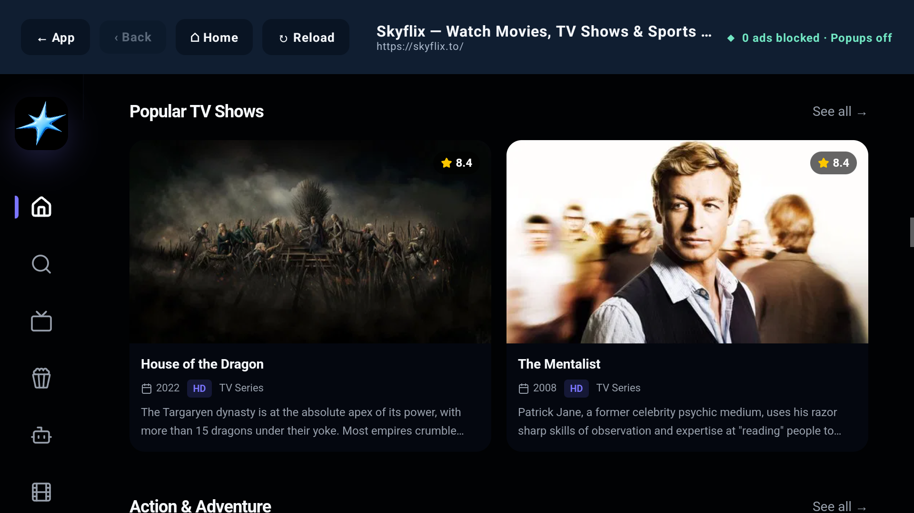

# GIZTV

Automatic signed app releases and in-app update setup are documented in [APP_UPDATES.md](APP_UPDATES.md).

GIZTV is an Android phone and TV app built with Kotlin and Compose. It browses a TMDB catalog of movies and TV series, and its URL launcher opens user-entered websites in a protected in-app browser with native adaptive HLS playback.




## Highlights

- TMDB catalog with Movies / TV Shows / My List tabs, Popular / Trending / Top rated listings, and per-tab title search
- Show landing page with artwork, synopsis, a season rail, and an episode list carrying stills, runtimes, and summaries
- Any episode is two moves away: pick a season across, pick an episode down
- Continue watching row that resumes movies and episodes at the second they were left
- Watched ticks and partial-progress bars on episodes, with a resume timestamp on each one
- Up next card at the end of an episode, rolling into the following one after ten seconds unless dismissed
- My List for saving shows and movies, kept across restarts
- Remembers the last tab, the last listing per tab, and the last season opened for each show
- Dual phone and TV launcher configuration with standard `LAUNCHER` and `LEANBACK_LAUNCHER` support
- Portrait phone layout with touch controls and responsive spacing for Pixel-sized screens; TVs remain landscape
- Tap-outside keyboard dismissal on the URL launcher
- D-pad navigation with clear scale and outline focus feedback
- TV timeline that also accepts touch: tap to seek, or drag to scrub with a live preview that commits on release
- URL entry with automatic `https://` normalization and validation
- Quick-access button for Skyflix
- Embedded browser with Google Safe Browsing left enabled
- Ad-host filtering, popup/alert blocking, and cosmetic ad cleanup
- Automatic `.m3u8` detection with cookies, referrer, and user-agent forwarding
- Native Media3 HLS playback with adaptive quality and a 15–60 second buffer window
- Automatic TV decoder recovery with hardware fallback, software-first compatibility retry, and a 720p/5 Mbps ceiling
- Automatic English subtitle selection with an on-screen CC status and subtitle picker
- TV-friendly player options for adaptive quality, audio track, subtitle size/position/style, playback speed, and decoder mode
- Real subtitle cue synchronization from 2 seconds early to 2 seconds late
- Chromecast sender controls with separate English subtitle tracks attached and selected for Cast playback
- Automatic English audio preference with manual switching among every audio track exposed by the stream
- Separate subtitle discovery and side-loading for WebVTT, SRT, SSA/ASS, and TTML tracks
- Multi-provider subtitle catalog discovery for VidGod, Bingr, and compatible subtitle/caption JSON APIs
- Exact English prioritized over hearing-impaired variants while retaining every discovered English option
- Responsive 10-foot interface tested at 1920×1080
- Compose for TV Material `1.1.0`
- Media3 `1.10.1`
- Minimum Android version: API 23
- Phone and TV profiles both covered by the connected test suite

## Build

```powershell
.\gradlew.bat :app:assembleDebug
```

The debug APK is written to `app/build/outputs/apk/debug/app-debug.apk`.

## Install on an Android phone

Enable **Install unknown apps** for the file manager or browser used to open the APK, then install `app-debug.apk`. GIZTV appears in the standard phone launcher and stays in portrait on phones such as Pixel. Android TV devices continue to use landscape.

For a connected Pixel or phone emulator:

```powershell
android run --device=<device-serial> --apks=app\build\outputs\apk\debug\app-debug.apk --activity=com.example.auroratv.MainActivity --type=ACTIVITY
```

## Run on the included TV emulator

```powershell
android emulator start Television_1080p_API_34
android run --device=emulator-5554 --apks=app\build\outputs\apk\debug\app-debug.apk --activity=com.example.auroratv.MainActivity --type=ACTIVITY
```

Use the emulator arrow keys and Enter key as a TV remote D-pad and Select button.

Enter a website address and select **Visit Website**, or use the **skyflix.to** quick-access button. Press the remote Back button to return from native playback to the browser, and again to return to the GIZTV launcher.

## Verification

```powershell
.\gradlew.bat :app:connectedDebugAndroidTest
.\gradlew.bat :app:lintDebug
```

The connected tests verify URL validation, browser actions, subtitle attachment, and that a real adaptive HLS playlist reaches Media3’s ready state on the TV emulator.
