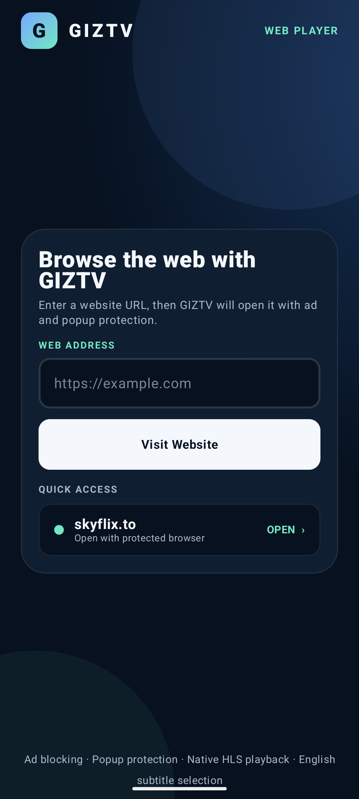

# GIZTV

Automatic signed app releases and in-app update setup are documented in [APP_UPDATES.md](APP_UPDATES.md).

GIZTV is an Android phone and TV app built with Kotlin and Compose. It browses a TMDB catalog of movies and TV series, includes a grouped and searchable IPTV guide, and opens user-entered websites in a protected in-app browser with native adaptive playback.




## Highlights

- TMDB catalog with Movies / TV Shows / My List tabs, Popular / Trending / Top rated listings, and per-tab title search
- Show landing page with artwork, synopsis, a season rail, and an episode list carrying stills, runtimes, and summaries
- Any episode is two moves away: pick a season across, pick an episode down
- Trailer button on every film and show page, handing the trailer to the YouTube app — or to a browser on a device without it — rather than embedding a player YouTube declines to serve inside other apps
- Continue watching row that resumes movies and episodes at the second they were left
- Watched ticks and partial-progress bars on episodes, with a resume timestamp on each one
- Up next card at the end of an episode, rolling into the following one after ten seconds unless dismissed
- My List for saving shows and movies, kept across restarts
- Remembers the last tab, the last listing per tab, and the last season opened for each show
- Dual phone and TV launcher configuration with standard `LAUNCHER` and `LEANBACK_LAUNCHER` support
- Portrait phone layout with touch controls and responsive spacing for Pixel-sized screens; TVs remain landscape
- Tap-outside keyboard dismissal on the URL launcher
- D-pad navigation with clear scale and outline focus feedback
- TV timeline that also accepts touch: tap to seek, or drag to scrub with a live preview that commits on release
- Phone player gestures: swipe vertically on the left for brightness or on the right for media volume
- URL entry with automatic `https://` normalization and validation
- Quick-access button for Skyflix
- Embedded browser with Google Safe Browsing left enabled
- Ad-host filtering, popup/alert blocking, and cosmetic ad cleanup
- Automatic `.m3u8` detection with cookies, referrer, and user-agent forwarding
- Anime catalogue from anidb.app with Trending / Top airing / Popular / Top rated / Latest / Newest ordering, TV / Movie / ONA / OVA / Special filters, and title search
- Anime listings continue as they are browsed rather than stopping at the first page
- Adult titles filtered out of every anime listing and search, by the source's own Hentai and Erotica genres plus the per-title Rx content rating
- Anime landing page carrying the site's own facts panel and synopsis, a numbered episode grid with filler marked, and a dub/sub choice remembered across titles
- Anime episodes resolve to a plain HLS playlist and play natively through Media3, with watch history and the continue-watching row treating them like any other episode
- Built-in M3U IPTV guide with group filters, channel search, artwork, and per-stream request headers
- Favourites and a recently watched row pinned to the front of the IPTV categories, kept across playlist refreshes
- Repeated listings of the same channel collapsed to one card that inherits every mirror as a backup source
- Native HLS, DASH, MPEG-TS, ClearKey, and Widevine IPTV playback through Media3
- Native Media3 HLS playback with adaptive quality and a 15–60 second buffer window
- Automatic TV decoder recovery with hardware fallback, software-first compatibility retry, and a 720p/5 Mbps ceiling
- Automatic English subtitle selection with an on-screen CC status and subtitle picker
- TV-friendly player options for adaptive quality, audio track, subtitle size/position/style, playback speed, and decoder mode
- Real subtitle cue synchronization from 2 seconds early to 2 seconds late
- Chromecast sender controls with separate English subtitle tracks attached and selected for Cast playback
- Automatic English audio preference with manual switching among every audio track exposed by the stream
- Separate subtitle discovery and side-loading for WebVTT, SRT, SSA/ASS, and TTML tracks
- Multi-provider subtitle catalog discovery for VidGod, Bingr, and compatible subtitle/caption JSON APIs
- Exact English prioritized over hearing-impaired variants while retaining every discovered English option
- Responsive 10-foot interface tested at 1920×1080
- Compose for TV Material `1.1.0`
- Media3 `1.10.1`
- Minimum Android version: API 23
- Phone and TV profiles both covered by the connected test suite

## Build

```powershell
.\gradlew.bat :app:assembleDebug
```

The debug APK is written to `app/build/outputs/apk/debug/app-debug.apk`. It is for development only — see [Install on an Android phone or TV](#install-on-an-android-phone-or-tv) for why it should never be the build handed to anyone else.

Releases are built and signed by the tag workflow rather than by hand; [APP_UPDATES.md](APP_UPDATES.md) covers publishing one.

## Install on an Android phone or TV

Download **`GIZTV-v<version>.apk`** from the [latest release](https://github.com/rileously/GIZTV/releases/latest). That is the signed build, and it is the only one that can take an in-app update later.

Do not hand out `app-debug.apk`. A debug build is signed with the local `CN=Android Debug` key rather than the release key, so a release APK can never install over it — anyone who starts on a debug build has to uninstall, losing watch history, before they can update again. It is also `debuggable`, which Android and Play Protect both treat with more suspicion.

Enable **Install unknown apps** for the file manager or browser used to open the APK. The permission is per-app and is normally only asked for once. GIZTV appears in the standard phone launcher and stays in portrait on phones such as Pixel; Android TV devices continue to use landscape.

### What Android will warn about, and why

Installing this way is a sideload, and recent Android versions say so twice. Both prompts are expected:

1. **"Install unknown apps"** — Android asking whether the browser or file manager may install packages at all.
2. **"App scan recommended" / "Send app to Play Protect?"** — Play Protect has not seen this app widely distributed before, so it offers to scan it. **Tap Scan and let it run.** It passes.

Neither warning means anything was detected. Play Protect trusts an app by the reputation of its package name and signing certificate together, and GIZTV is distributed from GitHub rather than the Play Store, so that pair stays "unknown" no matter how the APK is built. Nothing inside the APK can turn the prompt off.

If Play Protect ever says **"Unsafe app blocked"** rather than offering a scan, that is a different message and worth reporting as an issue.

### Verifying a download

Every release publishes the APK's SHA-256 in its notes and in `update.json`. To check a download before installing it:

```powershell
Get-FileHash .\GIZTV-v1.64.1.apk -Algorithm SHA256
```

The signing certificate is the same for every release from v1.52.0 onwards:

```
SHA-256  3E:EB:52:6A:A7:E3:60:05:18:5B:67:05:AE:F1:5F:DB:2A:E1:1A:90:81:6E:28:27:CB:3E:A1:E9:A9:CE:20:EB
```

### Staying updated

GIZTV checks for its own updates and installs them itself, so the sideload above is a one-time cost. [Obtainium](https://github.com/ImranR98/Obtainium) also tracks this repository's releases directly if you would rather manage updates from one place.

## Install a development build

For a connected Pixel, phone emulator, or TV emulator during development:

```powershell
android run --device=<device-serial> --apks=app\build\outputs\apk\debug\app-debug.apk --activity=com.giztv.tv.MainActivity --type=ACTIVITY
```

## Run on the included TV emulator

```powershell
android emulator start Television_1080p_API_34
android run --device=emulator-5554 --apks=app\build\outputs\apk\debug\app-debug.apk --activity=com.giztv.tv.MainActivity --type=ACTIVITY
```

Use the emulator arrow keys and Enter key as a TV remote D-pad and Select button.

Enter a website address and select **Visit Website**, or use the **skyflix.to** quick-access button. Press the remote Back button to return from native playback to the browser, and again to return to the GIZTV launcher.

## Verification

```powershell
.\gradlew.bat :app:connectedDebugAndroidTest
.\gradlew.bat :app:lintDebug
```

The connected tests verify URL validation, browser actions, subtitle attachment, and that a real adaptive HLS playlist reaches Media3’s ready state on the TV emulator.
